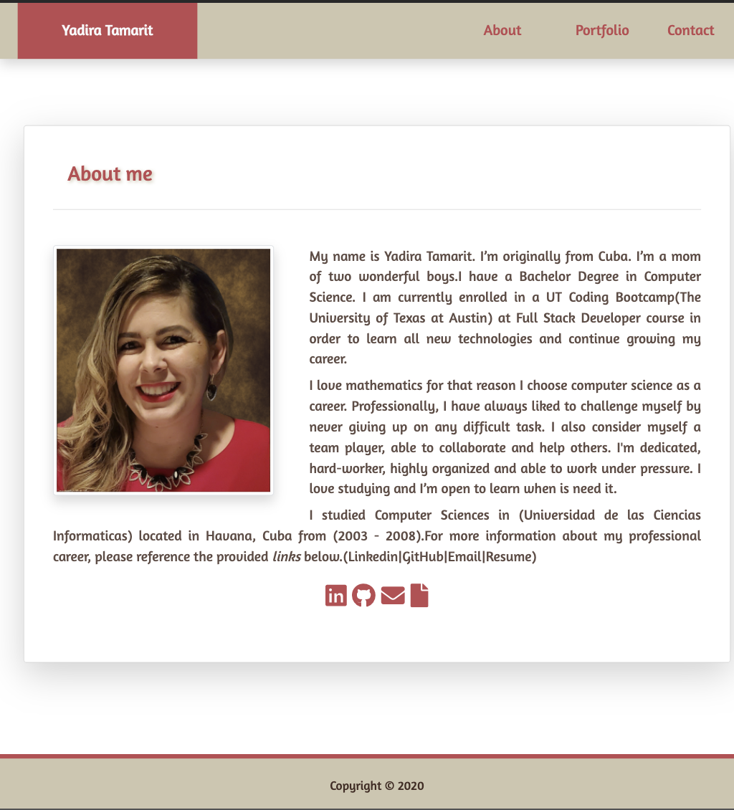

# Yadira's Portfolio

This project hosts the source code for my React Portfolio website.

## Installing / Getting Started

To test this project, simply clone project into a your local file system and open `index.html` in your favorite browser.

```
git clone https://github.com/ystamaritq/ystamaritq.github.io.git
cd ystamaritq.github.io/
open index.html
```

### Initial Configuration

No additional setup required.

## Developing

Below is a summary of the key files for this project and their purpose:

- **index.html** about me html page
- **portfolio.html** portfolio html page
- **contact.html** contact html page
- **assets** all images and css used by the website
- **/assets/css/style.css** custom css stylesheet
- **/assets/images** all images used by the website
- **/assets/css** all css used by the website

Additional Libraries:

- **bootstrap 4** This site uses bootstrap 4 css.

## Features

This site showcases a responsible website, with information about me, including my portfolio and contact form.



## Links

[Deployed link: Try it out!](https://ystamaritq.github.io/) </div>

[GitHub link](https://github.com/ystamaritq/ystamaritq.github.io) </div>

## Licensing

"The code in this project is licensed under MIT license."

---

**developed with love by **@ystamaritq\*\*\*\*
